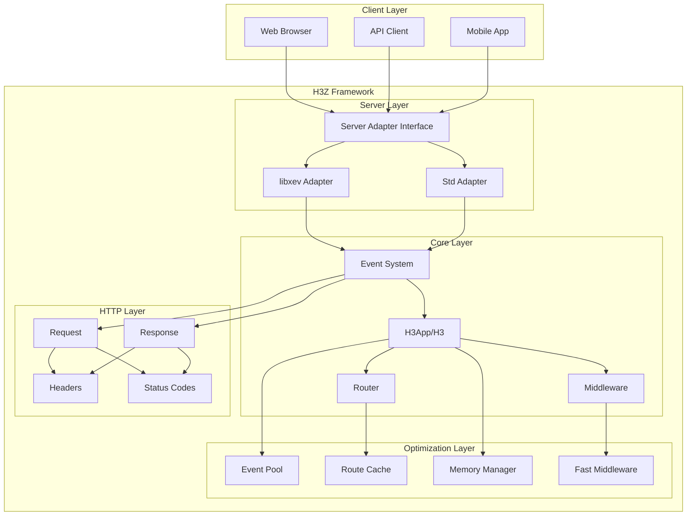
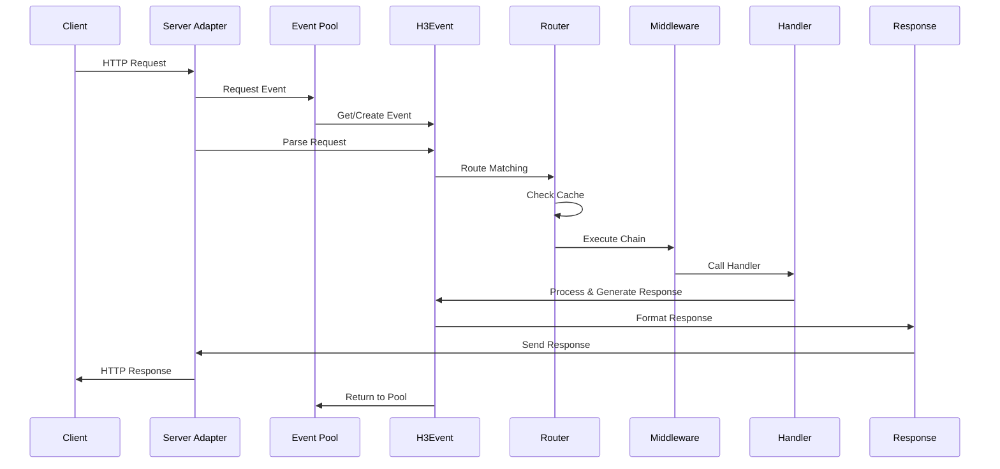
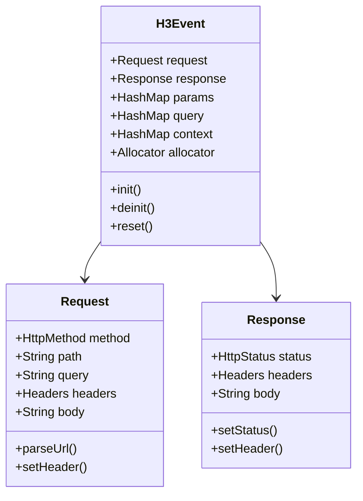
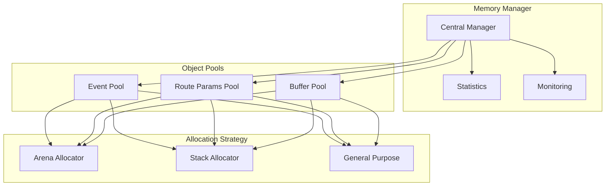
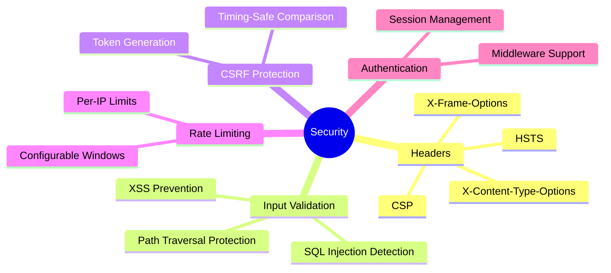
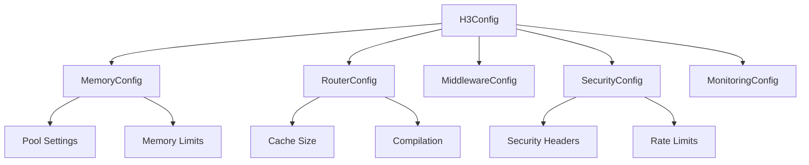

# H3Z Framework Overview

## Introduction

H3Z is a high-performance, zero-dependency HTTP server framework for Zig, inspired by the simplicity and elegance of H3.js. It provides a modern, type-safe API for building web applications and services while leveraging Zig's compile-time guarantees and memory safety features.

## Core Philosophy

### Zero Dependencies
H3Z achieves complete independence from external libraries (except libxev for async I/O), making it lightweight, predictable, and easy to deploy. This design choice ensures:
- Minimal attack surface
- Predictable behavior
- Simple deployment
- Full control over the codebase

### Performance First
Every architectural decision prioritizes performance:
- Object pooling to minimize allocations
- Zero-copy operations where possible
- Compile-time optimizations
- Efficient routing algorithms
- Asynchronous I/O with libxev

### Type Safety
Leveraging Zig's powerful type system:
- Compile-time route validation
- Type-safe HTTP methods and status codes
- Memory-safe operations
- Error unions for explicit error handling

## Architecture Overview



## Request Flow

The journey of an HTTP request through H3Z follows a carefully orchestrated path:



## Key Components

### 1. Application Layer

The framework provides two application models:

#### Legacy API (H3)
Simple, straightforward API for quick development:
- Familiar Express-like routing
- Built-in middleware support
- Easy migration path

#### Modern API (H3App)
Component-based architecture for complex applications:
- Modular design
- Dependency injection
- Advanced configuration
- Better testability

### 2. Event System

The H3Event is the central context object that encapsulates the entire request/response cycle:



#### The H3Event Lifecycle and Context Objects

When an HTTP request arrives at your server, H3Z creates an **H3Event** object that serves as a shared context throughout the entire request processing pipeline. This event object is passed through all middleware and handlers, allowing each component to:

1. **Read request data** - Access headers, body, query parameters, and route parameters
2. **Mutate the context** - Store computed values, user data, or middleware results
3. **Build the response** - Set status codes, headers, and response body

The **context** field within H3Event is particularly important - it's a key-value store that enables communication between different parts of your application without tight coupling:

- **Middleware can store data** for subsequent middleware or handlers (e.g., authenticated user info)
- **Handlers can access context data** set by earlier middleware (e.g., parsed request body, user permissions)
- **Post-processing middleware** can read context to perform cleanup or logging

This design enables a clean, modular architecture where each component focuses on its specific responsibility while still being able to share state when needed. The event flows through the system like this:

```
HTTP Request → Create H3Event → Middleware Chain → Route Handler → Response Middleware → Send Response → Cleanup H3Event
```

Each step in this pipeline receives the same H3Event instance, can read from it, and can mutate it as needed. This shared mutable state, encapsulated within the event object, is what makes H3Z both flexible and performant.

### 3. Routing System

H3Z uses a sophisticated Trie-based router for optimal performance:

```mermaid
graph TD
    ROOT[Root /]
    ROOT --> API[/api]
    ROOT --> USERS[/users]
    ROOT --> STATIC[/static]
    
    API --> V1[/v1]
    API --> V2[/v2]
    
    USERS --> USERID[/:id]
    USERS --> LIST[/list]
    
    V1 --> PRODUCTS[/products]
    V1 --> ORDERS[/orders]
    
    style USERID fill:#f9f,stroke:#333,stroke-width:2px
```

**Features:**
- O(n) complexity for route matching
- Parameter extraction (e.g., `/users/:id`)
- Wildcard support
- Method-specific routing
- LRU cache for frequently accessed routes

### 4. Middleware System

Two middleware implementations cater to different needs:

#### Traditional Middleware
- Flexible chain-of-responsibility pattern
- Full access to request/response cycle
- Suitable for complex transformations

#### Fast Middleware
- Optimized for common operations
- Minimal overhead
- Ideal for production environments


### 5. Memory Management

Sophisticated memory optimization strategies:



**Benefits:**
- Reduced allocation overhead
- Predictable memory usage
- Pool warming for consistent performance
- Memory leak detection in debug mode

### 6. Server Adapters

Abstraction layer for different I/O models:

#### libxev Adapter
- High-performance async I/O
- Event-driven architecture
- Thread pool support
- Cross-platform (Linux io_uring, macOS kqueue)

#### Standard Library Adapter
- Simple, synchronous I/O
- Easy debugging
- Minimal dependencies
- Good for development

## Performance Optimizations

### 1. Object Pooling
Pre-allocated objects reduce allocation overhead:
- Event objects
- Route parameters
- Response buffers

### 2. Route Compilation
Static routes can be compiled at build time for zero-overhead routing.

### 3. Zero-Copy Operations
Minimize data copying throughout the request pipeline:
- Direct buffer operations
- In-place parsing
- Efficient string handling

### 4. Fast Path Optimizations
Common operations have optimized paths:
- Static file serving
- JSON serialization
- Header parsing

## Security Features



## Configuration System

Hierarchical configuration with sensible defaults:



## Development Workflow

### Building and Testing


### Project Structure

```
h3z/
├── src/
│   ├── core/          # Framework core
│   ├── http/          # HTTP abstractions
│   ├── server/        # Server implementations
│   ├── utils/         # Utilities
│   └── h3.zig         # Main entry point
├── tests/             # Comprehensive test suite
├── examples/          # Usage examples
└── build.zig          # Build configuration
```

## Use Cases

H3Z excels in various scenarios:

### 1. RESTful APIs
- Type-safe routing
- Built-in JSON handling
- Middleware for authentication
- High performance

### 2. Microservices
- Small binary size
- Fast startup time
- Low memory footprint
- Easy containerization

### 3. Real-time Services
- Async I/O with libxev
- Connection pooling
- Efficient event handling
- WebSocket support (planned)

### 4. Static File Servers
- Zero-copy file serving
- MIME type detection
- Compression support
- Cache headers

## Future Roadmap

### Near Term
- SSL/TLS support
- WebSocket implementation
- HTTP/2 support
- Additional middleware

### Long Term
- HTTP/3 and QUIC
- Clustering support
- Plugin system
- GraphQL integration

## Comparison with Other Frameworks

### vs. Node.js/Express
- **Advantages**: Better performance, type safety, smaller footprint
- **Trade-offs**: Smaller ecosystem, newer technology

### vs. Go HTTP Servers
- **Advantages**: Compile-time safety, zero GC overhead
- **Trade-offs**: Less mature, smaller community

### vs. Rust Frameworks
- **Advantages**: Simpler syntax, faster compilation
- **Trade-offs**: Less established ecosystem

## Conclusion

H3Z represents a modern approach to HTTP server development, combining the simplicity of high-level frameworks with the performance and safety of systems programming. Its zero-dependency philosophy, coupled with thoughtful architecture and optimization strategies, makes it an excellent choice for developers seeking performance without sacrificing developer experience.

The framework's modular design ensures it can grow with your application, from simple APIs to complex microservice architectures, while maintaining predictable performance and resource usage throughout.